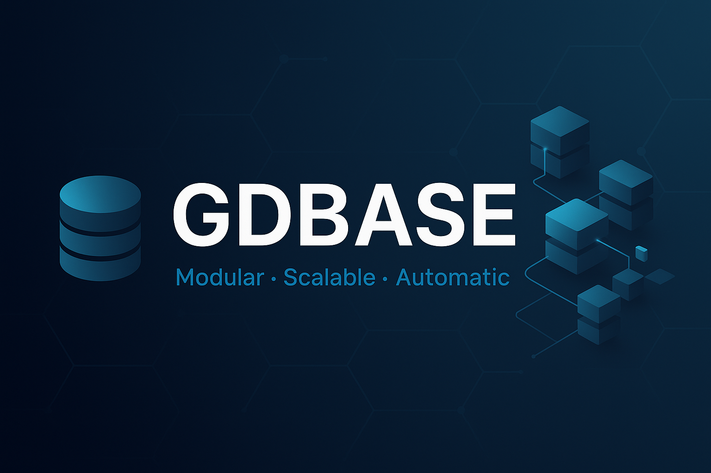

# GDBASE - Infraestrutura de Banco de Dados Modular



[](https://go.dev/)
[](https://github.com/rafa-mori/gdbase/blob/main/LICENSE)
[](#features)

---

**Gerenciamento de bancos de dados modular, escalável e automático para sistemas modernos.**

---

## **Table of Contents**

1. [About the Project](#about-the-project)
2. [Features](#features)
3. [Installation](#installation)
4. [Usage](#usage)
    - [CLI](#cli)
    - [Project Structure](#project-structure)
    - [Configuration](#configuration)
5. [Roadmap](#roadmap)
6. [Contributing](#contributing)
7. [Contact](#contact)

---

## **About the Project**

**GDBASE** é uma solução de gerenciamento de bancos de dados desenvolvida em Go, projetada para ser **modular, escalável e automática**. Permite configuração zero, mas suporta customizações avançadas via arquivos de configuração. Gerencia bancos locais, Docker e múltiplos bancos simultaneamente, ideal para sistemas distribuídos.

---

## **Features**

✨ **Configuração dinâmica e automática**

- Senhas geradas randômicamente e armazenadas no keyring.
- Portas ocupadas ajustadas automaticamente.

🗄️ **Compatível com múltiplos DBs**

- Redis, RabbitMQ, MongoDB, PostgreSQL e SQLite prontos para uso.

🏗️ **Arquitetura modular**

- Models seguem padrão `Model → Repo → Service`.
- Modularidade e organização garantidas.

🔐 **Túnel SSH para bancos externos**

- `gdbase ssh tunnel` conecta bancos remotos via SSH com segurança.

⚙️ **Orquestração via Docker**

- Geração automática de containers para portabilidade e fácil implantação.

📡 **Monitoramento e eventos**

- Event bus para rastreamento interno de ações.

---

## **Installation**

Requisitos:

- Go 1.19+
- Docker (para bancos em container)

Clone o repositório e compile:

```sh
# Clone o repositório
git clone https://github.com/rafa-mori/gdbase.git
cd gdbase
go build -o gdbase .
```

---

## **Usage**

### CLI

Inicie o servidor principal:

```sh
./gdbase start
```

Veja todos os comandos disponíveis:

```sh
./gdbase --help
```

**Principais comandos:**

| Comando      | Função                                             |
|--------------|----------------------------------------------------|
| `start`      | Inicializa `gdbase` e configura todos os serviços  |
| `status`     | Exibe status dos bancos de dados ativos            |
| `config`     | Cria um arquivo de configuração para customização  |
| `ssh tunnel` | Cria um túnel seguro para bancos externos via SSH  |
| `docker`     | Gerencia containers Docker para bancos de dados    |

### Project Structure

A implementação central segue uma arquitetura clara e modular:

```plaintext
./
├── cmd
│   ├── cli
│   ├── gen_models.go
│   ├── models.go
│   ├── main.go
│   ├── usage.go
│   └── wrpr.go
├── docs
│   └── assets
├── go.mod
├── go.sum
├── internal
│   ├── events
│   ├── models
│   └── services
├── tests
└── version
```

---

### Configuration

O GDBASE pode rodar sem configuração inicial, mas aceita customização via arquivos YAML/JSON. Por padrão, tudo é gerado automaticamente no primeiro uso.

Exemplo de configuração:

```yaml
postgres:
  host: localhost
  port: 5432
  user: gdbase
  password: secure
redis:
  host: localhost
  port: 6379
```

---

## **Roadmap**

- [x] Configuração dinâmica e automática
- [x] Suporte a múltiplos bancos (Redis, RabbitMQ, MongoDB, PostgreSQL, SQLite)
- [x] Túnel SSH integrado
- [x] Orquestração via Docker
- [ ] Plugins para novos bancos
- [ ] Dashboard web para monitoramento

---

## **Contributing**

Contribuições são bem-vindas! Sinta-se à vontade para abrir issues ou enviar pull requests. Veja o [Guia de Contribuição](docs/CONTRIBUTING.md) para mais detalhes.

---

## **Contact**

💌 **Developer**:  
[Rafael Mori](mailto:faelmori@gmail.com)  
💼 [Follow me on GitHub](https://github.com/rafa-mori)  
Estou aberto a colaborações e novas ideias. Se achou o projeto interessante, entre em contato!
